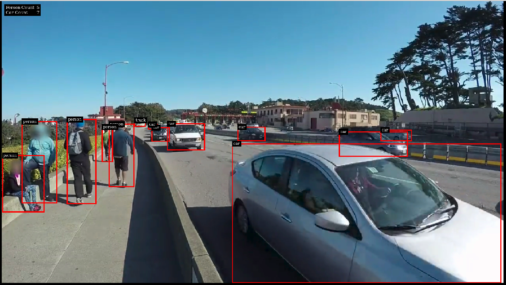

#  Object Detection with DeepStream 5.1 

<p align="center">
  
</p>

This project uses the Deepstream SDK for efficient inferencing on a YOLOv4 Object Detector.  
You can also the check a screencast video of me running the application [here](assets/output.mp4)

## 1. Requirements:
```
1. GStreamer 1.14.1
2. NVIDIA driver 460.32
3. CUDA 11.1
4. TensorRT 7.2.X
```

For information on installing the requirements you can check the following source.     
[Get started with Deepstream](https://docs.nvidia.com/metropolis/deepstream/dev-guide/text/DS_Quickstart.html)  
    

## 2. Run the application:
### 2.1 Clone the Repo
```sh
# clone the repo
git clone https://github.com/jayanthvarma134/DeepStream-Object-Detection.git

cd DeepStream-Object-Detection

```
### 2.2 Download the Weights file 
[yolov4.weights](https://yogeshiwizardsolutions-my.sharepoint.com/:u:/g/personal/jayanth_iwizardsolutions_com/EWc4JwRy3H5DtYxW5z_MDhIBgeVpCnLAYtWbjF4J1lVnmg?e=xPvLZO) 

Place the weights file in `models/YOLOv4`                                           

### 2.3 build the application
```sh 
make clean && make -j$(nproc)
```

### 2.4 Run 
```sh
# ALERT!! The application only takes input files of .h264 video format
./yolov4_detector test/test.h264
```

## 3. Convert your video files to .h264 format
```sh
#install ffmpeg
sudo apt-get install ffmpeg

# convert your videos.
ffmpeg -framerate 24 -i test.mp4 -c copy test2.h264
```


## 4.  further improvements:
```
1. enable multistream
2. save the output stream as a videofile 
3. Use secondary models in the pipeline 
4. Support for mp4 input files (Right now only works for .h264)
4. Have more fun with gstreamer
```
## 4. References:    

* [YLOv4-Deepstream](https://github.com/kn1ghtf1re/YOLOv4-Deepstream) by Akash James 
* [AlexeyAB/darknet](https://github.com/AlexeyAB/darknet)
* [NVIDIA DeepStream SDK Developer Guide](https://docs.nvidia.com/metropolis/deepstream/dev-guide/index.html)

